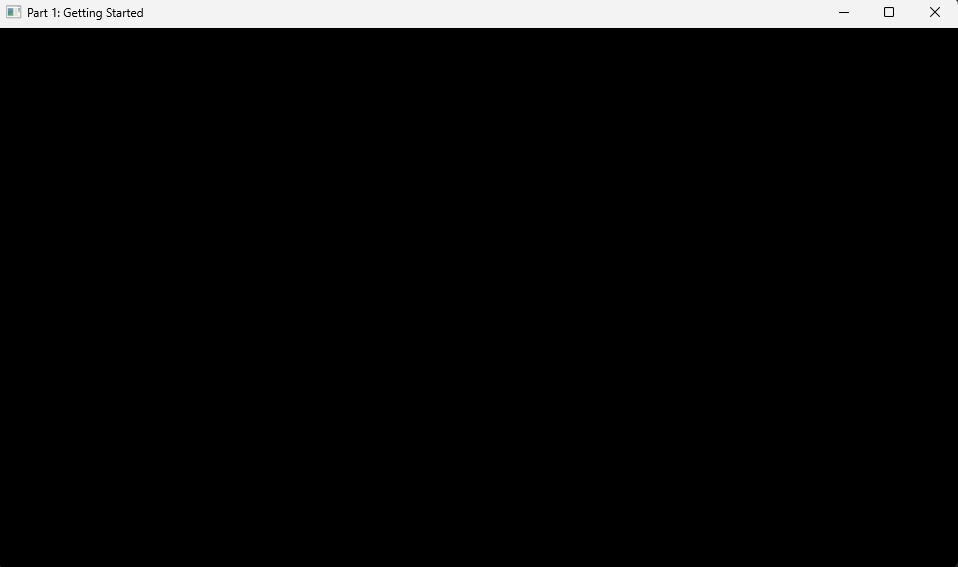
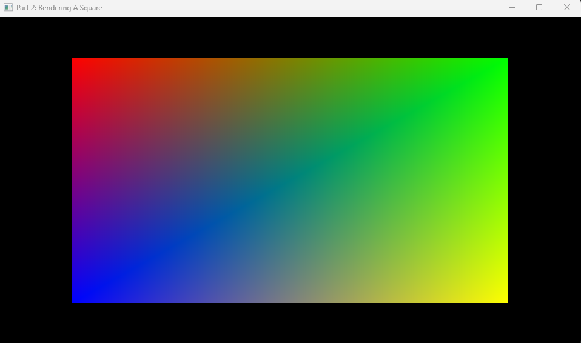

# Samples
This is the NeoVeldrid samples documentation, a collection of examples and guides for working with 
NeoVeldrid across a variety of use cases and integration scenarios. If a sample doesn't exist for
your use case, browse the [documentation](https://jhm-ciberman.github.io/neo-veldrid/index.html) 
or join our [Discord server](https://discord.gg/s5EvvWJ) for assistance from other developers.

The samples are organized into three main categories to help you find the right starting point for
your needs:

## Tutorials
Step-by-step guides designed to walk you through core concepts and common use cases.

|
[Part 1: Getting Started](tutorials/01-getting-started.md)
|
[Part 2: Rendering A Quad](tutorials/02-render-quad.md)
|
|-|-|
|||
|Open a window, create a graphics device, and begin the main loop.|Render a multi-colored quad in the center of the window.|
|||

## Integrations
Practical examples that showcase how NeoVeldrid works alongside other libraries, frameworks, and tools.

## Demos
Completed applications that showcase NeoVeldrid's capabilities in a real scenario, which is perfect 
for exploring advanced features in action and getting inspiration for your own projects.
